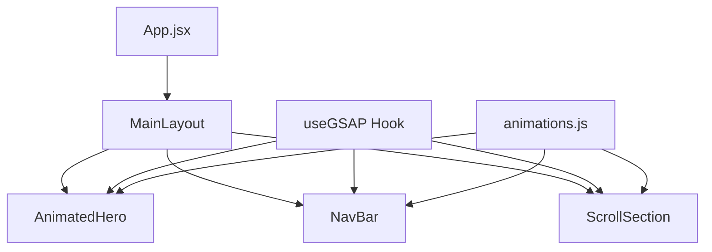

# Codebase Summary

## Key Components and Their Interactions

### Components
- **AnimatedHero**: Main hero section with entrance animations
  - Uses useGSAP hook for animation management
  - Implements smooth entrance transitions

- **NavBar**: Navigation component
  - Interactive animations on user interaction
  - Responsive design with Tailwind CSS

- **ScrollSection**: Scroll-triggered animation component
  - Integrates with GSAP ScrollTrigger
  - Handles scroll-based animations

### Custom Hooks
- **useGSAP**: Core animation hook
  - Manages GSAP context
  - Handles cleanup and memory management
  - Provides consistent animation API

### Layouts
- **MainLayout**: Primary layout component
  - Handles common layout structure
  - Manages global animation context

## Data Flow

## External Dependencies
- GSAP (3.12.5)
  - Core animation library
  - ScrollTrigger plugin
- React (18.2.0)
  - Frontend framework
- Tailwind CSS (3.4.1)
  - Utility-first styling

## Recent Significant Changes
- Initial project setup with Vite
- GSAP integration with custom hook
- Component structure implementation
- Documentation setup

## User Feedback Integration
- No user feedback yet - initial setup phase
- Prepared for:
  - Performance monitoring
  - Animation timing adjustments
  - Accessibility improvements
