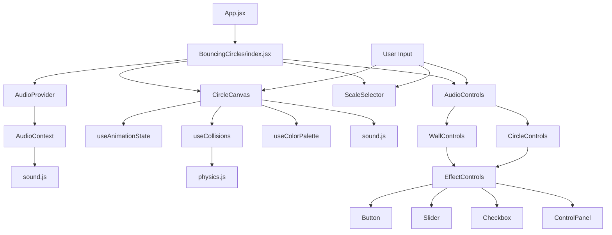

# Codebase Summary

## Key Components and Their Interactions

### Components
- **BouncingCircles**: Interactive physics-based animation
  - Modular architecture with subcomponents
  - Uses GSAP for smooth animations
  - Integrates Web Audio API for sound
  - Manages multiple collision states
  - Configurable sound parameters
  - Scale selection UI
  
  #### Subcomponents
  - **CircleCanvas**: Handles rendering and physics
    - Manages circle creation and animation
    - Handles collision detection and resolution
    - Implements squish animations
  
  - **ScaleSelector**: UI for selecting musical scales
    - Provides options for different musical scales
  
  - **AudioControls**: Sound parameter controls
    - **WallControls**: Wall collision sound settings
    - **CircleControls**: Circle collision sound settings
    - **EffectControls**: Base component for audio effects

- **AnimatedHero**: Main hero section with entrance animations
  - Uses useGSAP hook for animation management
  - Implements smooth entrance transitions

- **NavBar**: Navigation component
  - Interactive animations on user interaction
  - Responsive design with Tailwind CSS

- **ScrollSection**: Scroll-triggered animation component
  - Integrates with GSAP ScrollTrigger
  - Handles scroll-based animations

### Shared Components
- **Button**: Reusable button component with hover effects
- **Slider**: Reusable slider component for numeric inputs
- **Checkbox**: Reusable checkbox component
- **ControlPanel**: Container for grouping related controls

### Utilities
- **sound.js**: Audio system manager
  - Web Audio API integration
  - Musical scale definitions
  - Sound generation and control
  - Stereo panning
  - Configurable durations
  - Audio effects (delay, reverb, distortion, tremolo)

- **physics.js**: Collision system
  - Circle collision detection
  - Physics-based resolution
  - Position and velocity management

### Custom Hooks
- **useGSAP**: Core animation hook
  - Manages GSAP context
  - Handles cleanup and memory management
  - Provides consistent animation API

- **useAnimationState**: Animation state management
  - Manages GSAP timelines and tickers
  - Handles animation state and cleanup

- **useCollisions**: Physics and collision management
  - Handles circle and wall collisions
  - Manages physics state
  - Provides collision events

- **useColorPalette**: Color management
  - Generates and manages color palettes
  - Creates gradient backgrounds

### Context
- **AudioContext**: Global audio settings management
  - Centralizes audio parameter state
  - Provides actions for updating audio settings
  - Syncs state with sound.js utilities

### Layouts
- **MainLayout**: Primary layout component
  - Handles common layout structure
  - Manages global animation context

## Data Flow

## External Dependencies
- GSAP (3.12.5)
  - Core animation library
  - Timeline management
  - Ticker system for continuous animations
- React (18.2.0)
  - Frontend framework
  - State management
  - Component lifecycle
  - Context API for global state
- Web Audio API
  - Sound generation
  - Audio context management
  - Stereo panning
  - Audio effects processing
- Tailwind CSS (3.4.1)
  - Utility-first styling

## Recent Significant Changes
- Refactored BouncingCircles component into modular architecture
- Implemented custom hooks for better separation of concerns:
  - useAnimationState for GSAP animations
  - useCollisions for physics management
  - useColorPalette for color generation
- Created reusable UI components (Button, Slider, Checkbox, ControlPanel)
- Added AudioContext for centralized audio state management
- Separated audio controls by type (wall vs. circle collisions)
- Improved code organization and maintainability
- Added comprehensive documentation
- Implemented audio effects (delay, reverb, distortion, tremolo)
- Fixed background animation persistence across component re-renders using refs
- Enhanced button hover animation with GSAP timelines and random colors for each hover
- Improved animation consistency between container background and button hover effects
- Modified Button component to support ref forwarding for animation control

## User Feedback Integration
- Sound duration controls added based on needs
- Multiple scale options for musical variety
- Smooth animations with proper cleanup
- Improved UI organization with collapsible controls
- Better separation of wall and circle collision sound settings
- Prepared for:
  - Additional musical scales
  - More audio features
  - Performance optimizations
  - Enhanced visual effects
