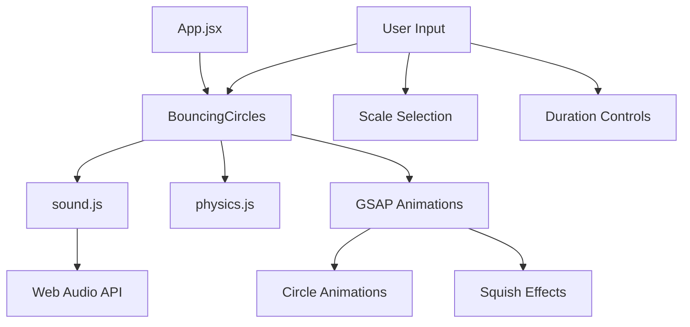

# Codebase Summary

## Key Components and Their Interactions

### Components
- **BouncingCircles**: Interactive physics-based animation
  - Uses GSAP for smooth animations
  - Integrates Web Audio API for sound
  - Manages multiple collision states
  - Configurable sound parameters
  - Scale selection UI

- **AnimatedHero**: Main hero section with entrance animations
  - Uses useGSAP hook for animation management
  - Implements smooth entrance transitions

- **NavBar**: Navigation component
  - Interactive animations on user interaction
  - Responsive design with Tailwind CSS

- **ScrollSection**: Scroll-triggered animation component
  - Integrates with GSAP ScrollTrigger
  - Handles scroll-based animations

### Utilities
- **sound.js**: Audio system manager
  - Web Audio API integration
  - Musical scale definitions
  - Sound generation and control
  - Stereo panning
  - Configurable durations

- **physics.js**: Collision system
  - Circle collision detection
  - Physics-based resolution
  - Position and velocity management

### Custom Hooks
- **useGSAP**: Core animation hook
  - Manages GSAP context
  - Handles cleanup and memory management
  - Provides consistent animation API

### Layouts
- **MainLayout**: Primary layout component
  - Handles common layout structure
  - Manages global animation context

## Data Flow

## External Dependencies
- GSAP (3.12.5)
  - Core animation library
  - Timeline management
- React (18.2.0)
  - Frontend framework
  - State management
  - Component lifecycle
- Web Audio API
  - Sound generation
  - Audio context management
  - Stereo panning
- Tailwind CSS (3.4.1)
  - Utility-first styling

## Recent Significant Changes
- Added BouncingCircles component with physics
- Implemented Web Audio API integration
- Added musical scales (C Major, A Minor, F Lydian)
- Added configurable sound durations
- Enhanced collision animations
- Improved UI controls

## User Feedback Integration
- Sound duration controls added based on needs
- Multiple scale options for musical variety
- Smooth animations with proper cleanup
- Prepared for:
  - Additional musical scales
  - More audio features
  - Performance optimizations
  - Enhanced visual effects
